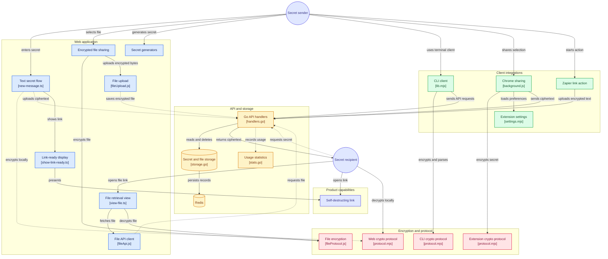

```mermaid
%% Generated by https://gitdiagram.com/shingrus/1time.io
flowchart TD

subgraph group_web["Web application"]
  node_webtext["Text secret flow<br/>[new-message.ts]"]
  node_ready["Link-ready display<br/>[show-link-ready.ts]"]
  node_filecreate["Encrypted file sharing"]
  node_fileview["File retrieval view<br/>[view-file.ts]"]
  node_generators["Secret generators"]
  node_fileupload["File upload<br/>[fileUpload.js]"]
  node_fileapi["File API client<br/>[fileApi.js]"]
end

subgraph group_backend["API and storage"]
  node_api["Go API handlers<br/>[handlers.go]"]
  node_storage[("Secret and file storage<br/>[storage.go]")]
  node_stats["Usage statistics<br/>[stats.go]"]
  node_redis[("Redis")]
end

subgraph group_clients["Client integrations"]
  node_cli["CLI client<br/>[lib.mjs]"]
  node_extension["Chrome sharing<br/>[background.js]"]
  node_extsettings["Extension settings<br/>[settings.mjs]"]
  node_zapier["Zapier link action"]
end

subgraph group_security["Encryption and protocol"]
  node_webprotocol["Web crypto protocol<br/>[protocol.mjs]"]
  node_filecrypto["File encryption<br/>[fileProtocol.js]"]
  node_cliprotocol["CLI crypto protocol<br/>[protocol.mjs]"]
  node_extprotocol["Extension crypto protocol<br/>[protocol.mjs]"]
end

subgraph group_operations["Product capabilities"]
  node_sharelink["Self-destructing link"]
end

node_sender(("Secret sender"))
node_recipient(("Secret recipient"))

node_sender -->|"enters secret"| node_webtext
node_webtext -.->|"encrypts locally"| node_webprotocol
node_webtext -.->|"uploads ciphertext"| node_api
node_webtext -->|"shows link"| node_ready
node_ready -->|"presents"| node_sharelink
node_recipient -->|"opens link"| node_sharelink
node_recipient -.->|"requests secret"| node_api
node_api -->|"reads and deletes"| node_storage
node_storage -->|"persists records"| node_redis
node_api -->|"returns ciphertext"| node_recipient
node_recipient -->|"decrypts locally"| node_webprotocol
node_sender -->|"selects file"| node_filecreate
node_filecreate -->|"encrypts file"| node_filecrypto
node_filecreate -->|"uploads encrypted bytes"| node_fileupload
node_fileupload -.->|"saves encrypted file"| node_api
node_recipient -->|"opens file link"| node_fileview
node_fileview -->|"fetches file"| node_fileapi
node_fileview -->|"decrypts file"| node_filecrypto
node_fileapi -.->|"requests file"| node_api
node_sender -->|"generates secret"| node_generators
node_sender -->|"uses terminal client"| node_cli
node_cli -->|"encrypts and parses"| node_cliprotocol
node_cli -->|"sends API requests"| node_api
node_sender -->|"shares selection"| node_extension
node_extension -->|"encrypts secret"| node_extprotocol
node_extension -->|"loads preferences"| node_extsettings
node_extension -->|"sends ciphertext"| node_api
node_sender -->|"starts action"| node_zapier
node_zapier -->|"uploads encrypted text"| node_api
node_api -.->|"records usage"| node_stats

click node_webtext "https://github.com/shingrus/1time.io/blob/master/frontend/src/islands/new-message.ts"
click node_ready "https://github.com/shingrus/1time.io/blob/master/frontend/src/islands/show-link-ready.ts"
click node_filecreate "https://github.com/shingrus/1time.io/blob/master/frontend/src/islands/secure-file-share.ts"
click node_fileview "https://github.com/shingrus/1time.io/blob/master/frontend/src/islands/view-file.ts"
click node_generators "https://github.com/shingrus/1time.io/blob/master/frontend/src/lib/generator-presets.ts"
click node_webprotocol "https://github.com/shingrus/1time.io/blob/master/frontend/src/lib/protocol.mjs"
click node_filecrypto "https://github.com/shingrus/1time.io/blob/master/frontend/src/lib/fileProtocol.js"
click node_fileupload "https://github.com/shingrus/1time.io/blob/master/frontend/src/lib/fileUpload.js"
click node_fileapi "https://github.com/shingrus/1time.io/blob/master/frontend/src/lib/fileApi.js"
click node_cli "https://github.com/shingrus/1time.io/blob/master/cli/lib.mjs"
click node_cliprotocol "https://github.com/shingrus/1time.io/blob/master/cli/protocol.mjs"
click node_extension "https://github.com/shingrus/1time.io/blob/master/extension/background.js"
click node_extprotocol "https://github.com/shingrus/1time.io/blob/master/extension/protocol.mjs"
click node_extsettings "https://github.com/shingrus/1time.io/blob/master/extension/settings.mjs"
click node_zapier "https://github.com/shingrus/1time.io/blob/master/zap/creates/create_one_time_link.js"
click node_api "https://github.com/shingrus/1time.io/blob/master/backend/handlers.go"
click node_storage "https://github.com/shingrus/1time.io/blob/master/backend/storage.go"
click node_stats "https://github.com/shingrus/1time.io/blob/master/backend/stats.go"

classDef toneNeutral fill:#f8fafc,stroke:#334155,stroke-width:1.5px,color:#0f172a
classDef toneBlue fill:#dbeafe,stroke:#2563eb,stroke-width:1.5px,color:#172554
classDef toneAmber fill:#fef3c7,stroke:#d97706,stroke-width:1.5px,color:#78350f
classDef toneMint fill:#dcfce7,stroke:#16a34a,stroke-width:1.5px,color:#14532d
classDef toneRose fill:#ffe4e6,stroke:#e11d48,stroke-width:1.5px,color:#881337
classDef toneIndigo fill:#e0e7ff,stroke:#4f46e5,stroke-width:1.5px,color:#312e81
classDef toneTeal fill:#ccfbf1,stroke:#0f766e,stroke-width:1.5px,color:#134e4a
class node_webtext,node_ready,node_filecreate,node_fileview,node_generators,node_fileupload,node_fileapi toneBlue
class node_api,node_storage,node_stats,node_redis toneAmber
class node_cli,node_extension,node_extsettings,node_zapier toneMint
class node_webprotocol,node_filecrypto,node_cliprotocol,node_extprotocol toneRose
class node_sharelink,node_sender,node_recipient toneIndigo
```
